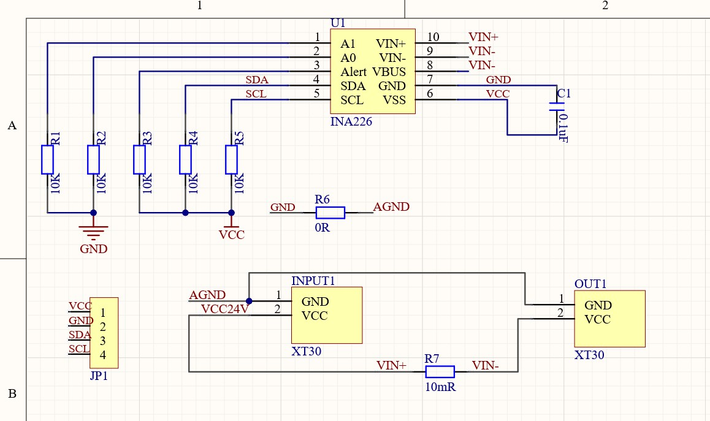
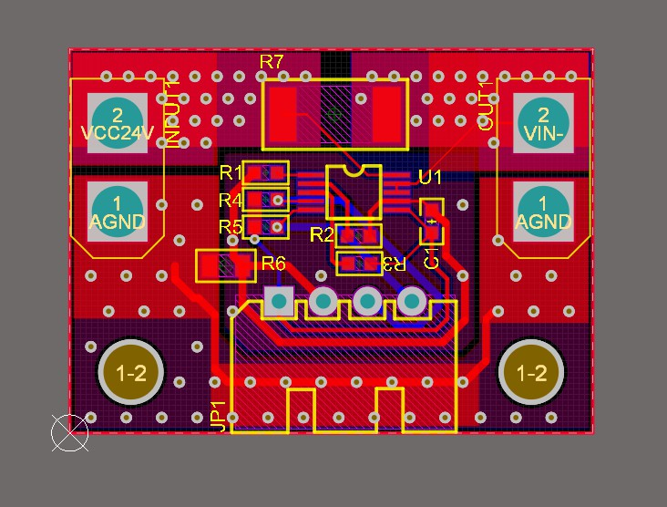
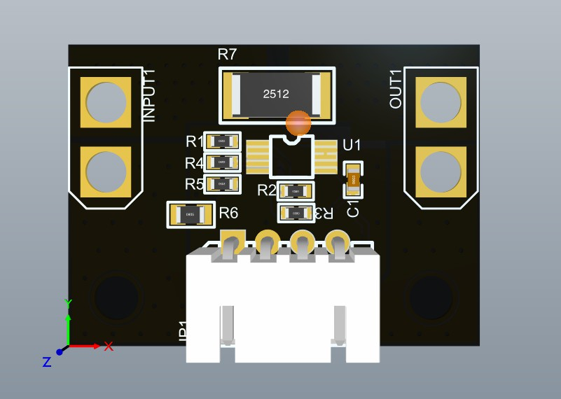

**@版权所有->SEASKY**

**LICENSE:** **MIT License**

**说明：**

- INA226是一款高精度电流检测芯片，同时附带有一路电压检测通道，因此，它可以同时实现电压和电流检测，因此，可以使用它来做功率检测模块。
- 同时INA226最大检测电压可以达到40V，支持高侧采样，使用INA226可以很好的嵌入到部分半桥全桥驱动电路的高侧电流采样端，当然工作电压不能超过40V。

