##机械键盘DIY教程第一期
**@版权所有->SEASKY**

**LICENSE:** **MIT License**
##
> 看了一些网上的机械键盘diy教程，大都是用买的pcb和元件来焊接，pcb由联系厂家定制，现在我们来一个完全的，正真意义上的DIY教程，从元件选取，到PCB布局，再到焊接，完全可以自己一个人实现。
> 

#1.0原理部分
	1.1.本机械键盘选择使用stm32的usb-hid实现有线的hid键盘通信。
	1.2.选择使用蓝牙HID模块HC-04实现无线HID通信功能(具体情况淘宝搜索蓝牙HID模块就能找到啦)。
	1.3.键盘使用按键扫描。
	1.4.机械键盘看情况是否需要RGB灯效，我这里是做了RGB灯的选择的RGB是比较流行的WS2812B，封装选的和
	普通RGB大小一样的3512，当然为了能把LED贴在轴体里面还选择了反贴的3512封装，这个封装也可以叫6028，
	它相比比其他的优点:毫无疑问控制方面，节省IO资源；6028封装方便贴片。具体见后面分析。
	1.5.程序部分就不在这里说了。
	1.6.无线需要电源，我只留了接口，自己买个电池，做个dcdc到5v即可扩展。
	1.7.预留了一些接口包括OLED，串口，can等，方便扩展功能，我这里做的是一个LD3320语音识别模块。

#PCB绘制教程

----------

#1.首先需要找到机械键盘轴体的封装：

#上面是我从淘宝中找的图下面是pcb封装，pcb封装库我直接用的gh60的cherry轴元件库，大多数轴体都是兼容的
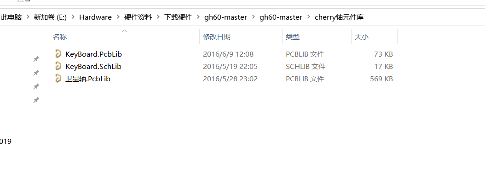

#当然遗憾的是GH60开源的封装库里面没有3d封装，接下来我们需要稍稍更改一下这个，需要把3512led的封装集成到里面去
#更改前
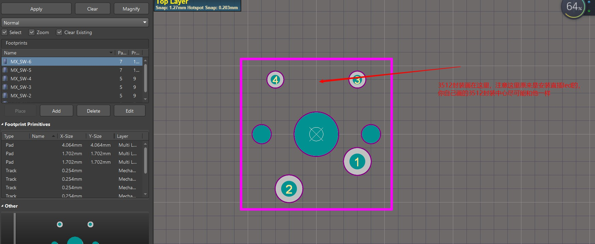
#更改后，注意3512贴背面，这也是为什么选择这个封装。

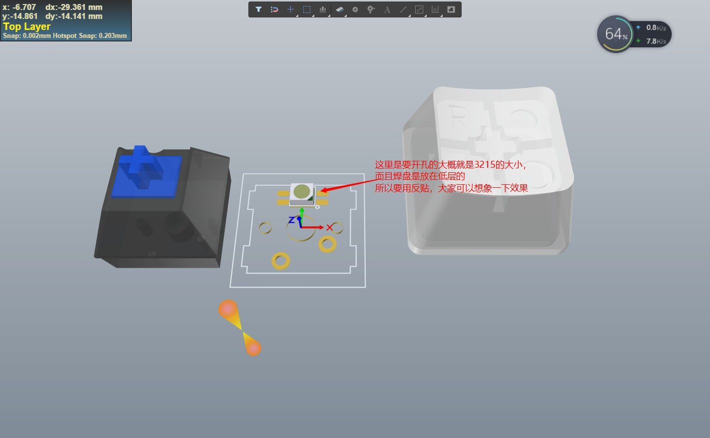
#至于3D封装嘛，自己画或者网上找，当然这个也只有3512后键帽是我自己画的，轴体的step网上能找到。关于画键帽的教材在后续教程，当然这个也不重要。

----------
#2.pcb布局部分，相信搜这个的大部分是关心机械键盘在pcb中怎么布局的问题，在这里我就先把轴体的布局讲一下：

##a.先了解两个网站
###keyboard-layout官网[http://www.keyboard-layout-editor.com/](http://www.keyboard-layout-editor.com/)
###和另一个网站[http://builder.swillkb.com/](http://builder.swillkb.com/)
###如果是ORCAD的话据说只需要上面的一个网站keyboard-layou
##b.大家先进入keyboard-layout官网[http://www.keyboard-layout-editor.com/](http://www.keyboard-layout-editor.com/)
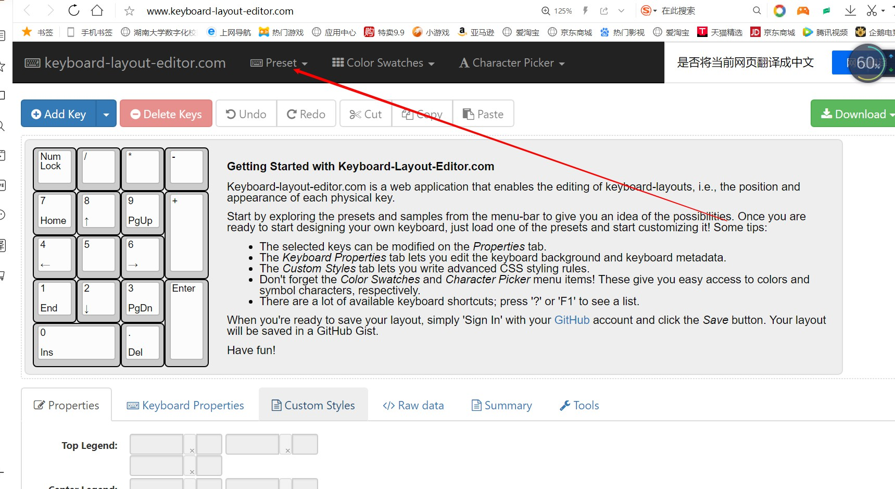

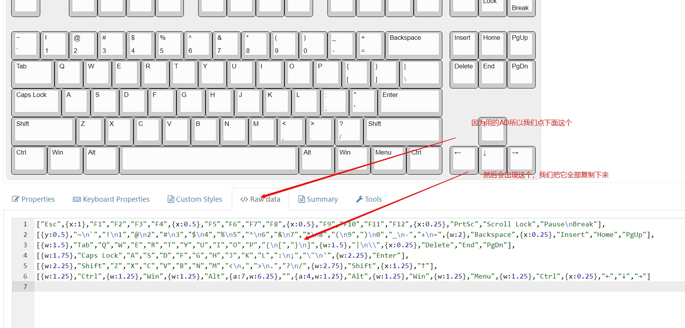

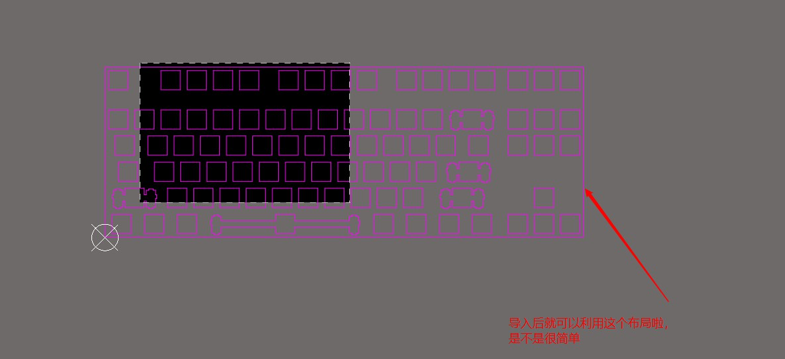

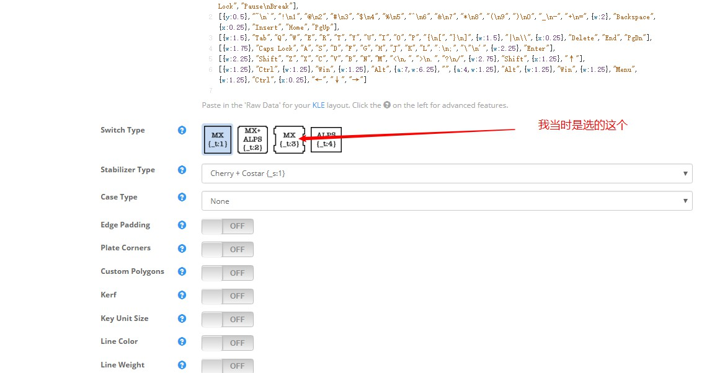
###感兴趣可以都导出对比一下，附上一张全部对比固定，放置后ad中务必选择固定，避免重复劳动
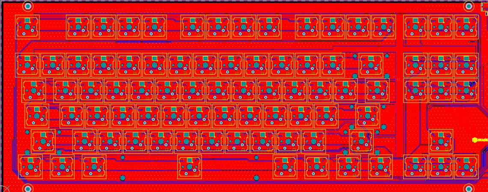
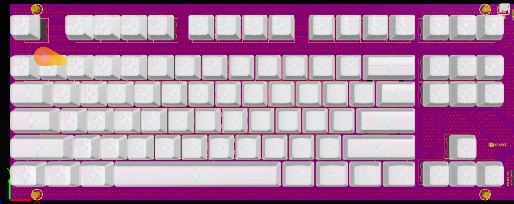
###注意像空格键，shift键这些还要留一个支架的固定孔，算了就叫支架吧，不记得名字了，这个支架的封装在cherry轴元件库里面可以找到

----------
#3.原理图部分：
###a.芯片选型如果用stm32f1的话，感觉扩展性不大，所以选型方向我们选择f4，在f4里面我们选择了成本较低性能较强的stm32f405芯片.
###b.引脚分配，直接在stm32cube_mx上分配了，看手册太不直观了，分配如下。
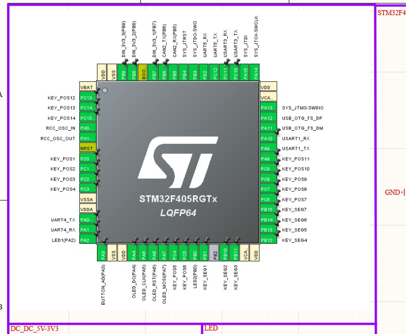
####stm32f405核心部分
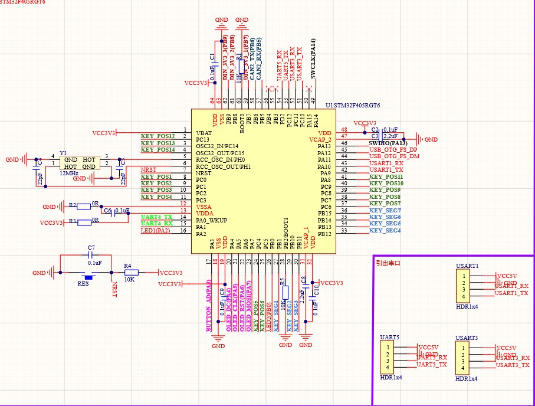
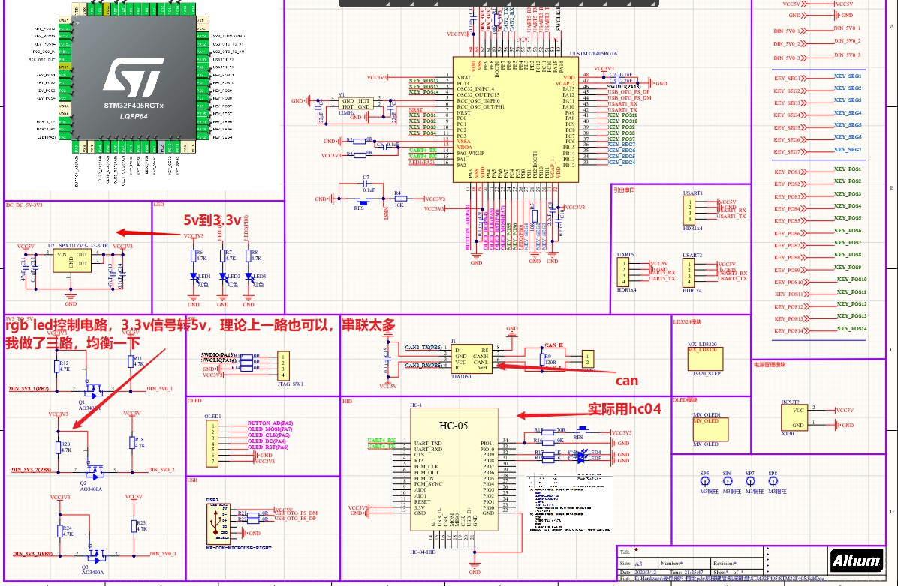

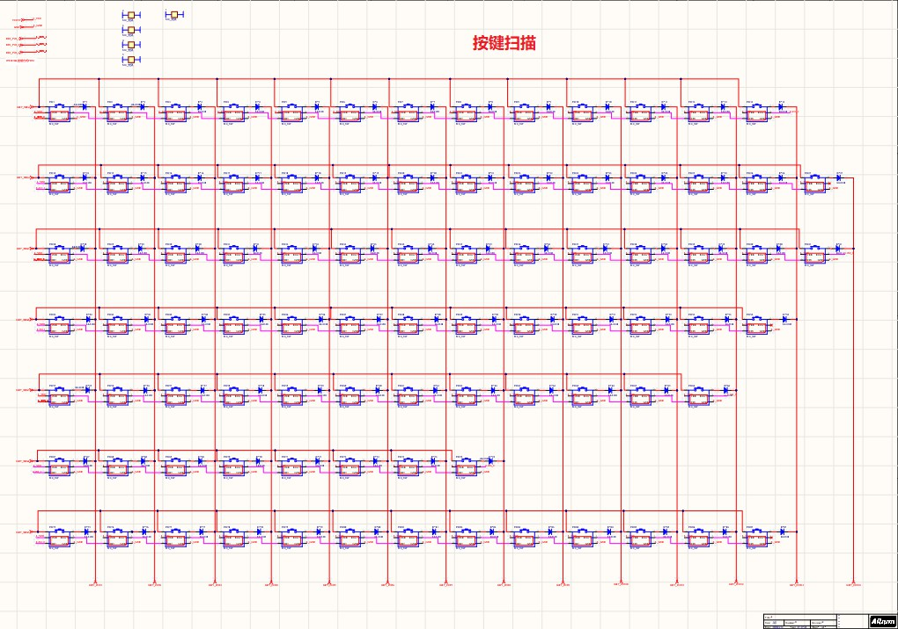
#4.pcb布线结果：
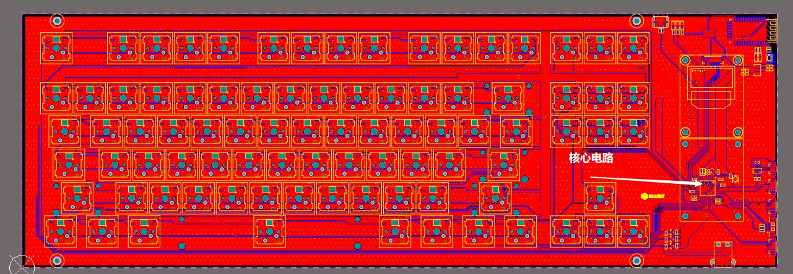
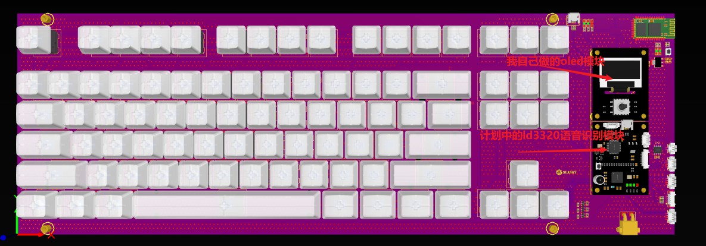
###自己附加做了OLED模块，OLED完美兼容大疆ROBOMASTER的OLED，已经用了很久了；另一个就是LD3320语音识别模块，当然被困在家嘛，没法检验，LD3320语音识别模块上面还预留了指纹识别模块接口的，意味着LD3320模块不仅支持语音识别，还支持语音识别，这个模块主要是用来魔改机械键盘的。

#原理图开源了，PCB暂时不开源，需要等到检验后开源

#附上几张3d渲染图

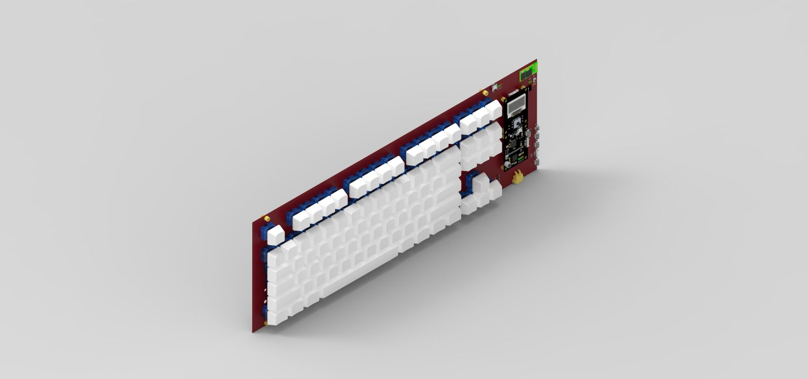

