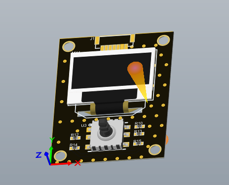
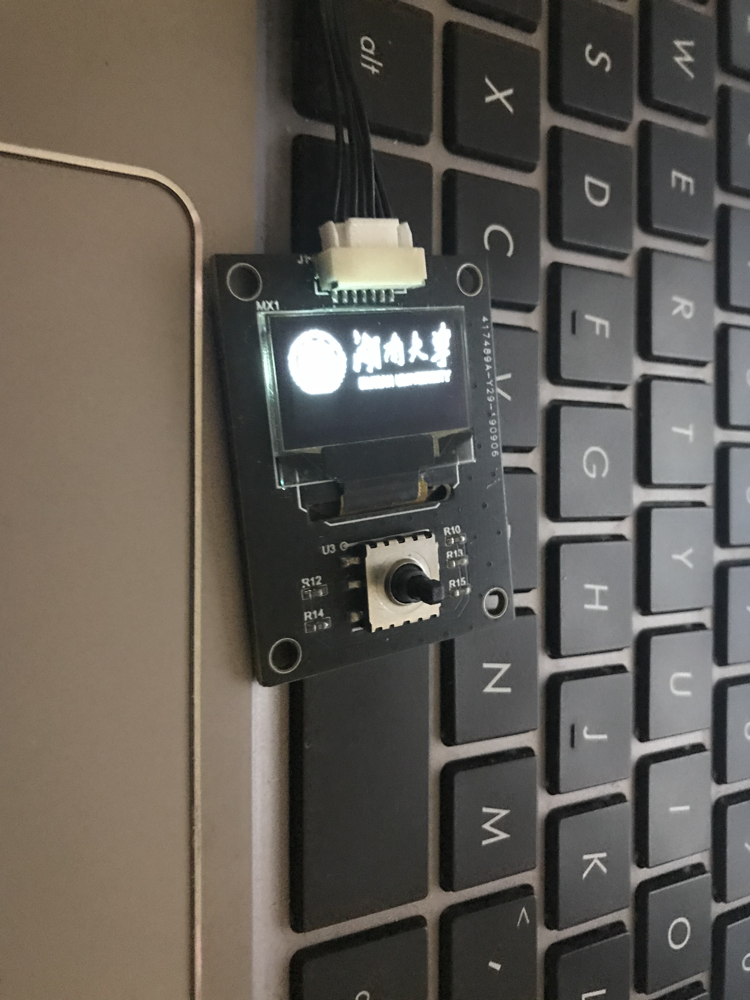
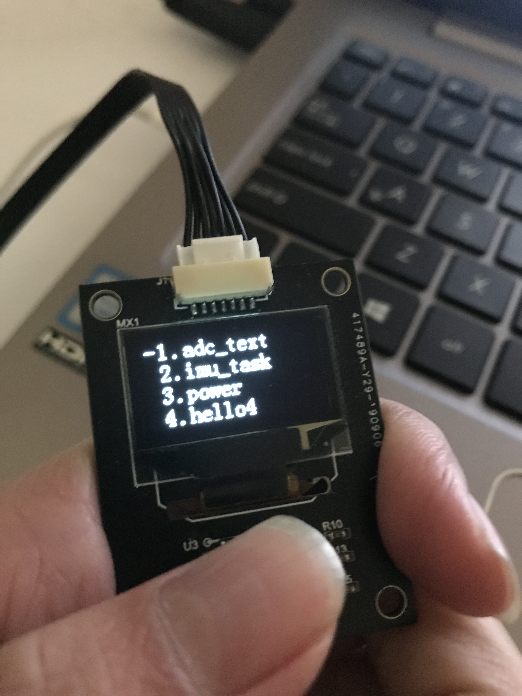

开源一款OLED

此OLED完美兼容大疆OLED，可以直接接在RoboMaster开发板上使用

附上使用视频：[https://b23.tv/BV1mV411f7mR](https://b23.tv/BV1mV411f7mR "bilibili_OLED效果演示")

该项目包含：

1.0完整的AD工程文档。

2.0基于STM32F407+Keil5的完整演示程序，当然程序兼容部分STM32F4系列单片机，只需要IO相同即可。

3.0OLED调试工具

如需技术交流请进SEASKY开源技术交流群:893445794
